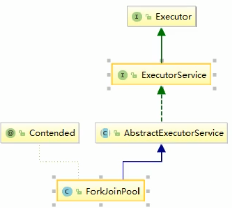

# Java8 新特性

## 函数式接口(jdk-1.8开始提供)

四大函数式接口：

  

## ForkJoinPool....

分支合并框架。  

ForkJoinPool, ForkJoinTask, RecursiveTask  



把大任务分解成小任务，来并行执行(fork)，计算完后再合并起来(join)


## 异步回调

**CompletableFuture**  

可以实现无返回调用，也可以实现有返回调用  

  

# HashMap

## Integer.highestOneBit(i)

获得i这个数二进制形式最左边的最高位为1，其他位补零的数。实际效果就是，返回给定数字的向下最接近2次幂的数字。例如9，向下最接近2次幂的数就为8。  

https://blog.csdn.net/jessenpan/article/details/9617749

## JDK1.7 roundUpToPowerOf2(i) ----- JDK 1.8 tableSizeFor(i)

```java
//1.8
static final int tableSizeFor(int cap) {
    int n = cap - 1;
    n |= n >>> 1;
    n |= n >>> 2;
    n |= n >>> 4;
    n |= n >>> 8;
    n |= n >>> 16;
    return (n < 0) ? 1 : (n >= MAXIMUM_CAPACITY) ? MAXIMUM_CAPACITY : n + 1;
}
```

  

获得给定数字向上最靠近2次幂的数字，例如9，那么获得的就是16这个数字。**减一是考虑了当给定的数字就是2次幂的情况**  

## 为什么数组长度要为2次幂

1、方便用与运算来替代取模操作

```java
//1.8
if ((p = tab[i = (n - 1) & hash]) == null)
//1.7用的是indexFor方法，内容是一样的
```

> 例如数组长度为16，hashcode为0101 1010，得到数组下标的运算为 hashcode & (length - 1)
>
> 那么  length - 1 = 0000 1111
>
> ​         hashcode = 0101 1010
>
> 做一次与运算得到 0000 1010，正好是取模的值，由此也可以看出，长度-1之后，位为1的区段就是数组的取值范围

## 为什么获得hashcode之后，高16位要与低16位进行与运算

```java
//1.8
static final int hash(Object key) {
    int h;
    return (key == null) ? 0 : (h = key.hashCode()) ^ (h >>> 16);
}
```

因为，与运算，两个位只要有一位变化，结果也会发生变化。这样让高位也参与运算，提高散列性。

## JDK1.7与JDK1.8的扩容条件不同

在1.7中，扩容有两个条件  

  

1、当前size大于阈值  

2、**当前所要放入的数组所在位置不为空**  

