[TOC]

# JVM与GC解析

## Jvm内存结构


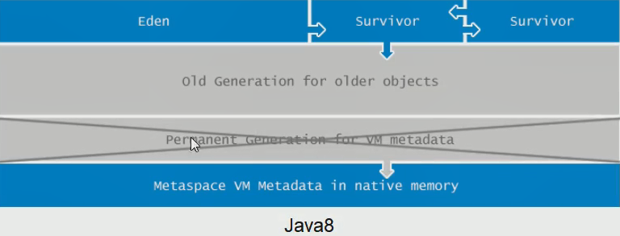

## 面试题

### 谈谈你对GC-Roots的理解

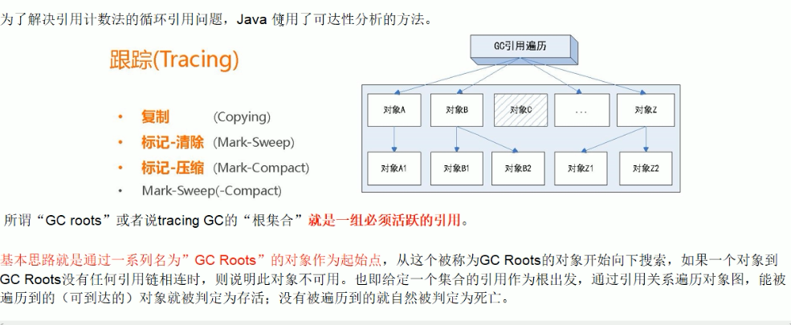

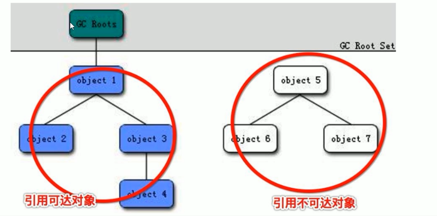

**以下对象可以成为GC-Roots对象**

1、虚拟机栈(栈帧中的局部变量表)中的引用的对象  
2、方法区中的类静态属性引用的对象  
3、方法区中常量引用的对象  
4、本地方法栈中JNI(Native方法)引用的对象  

## JVM参数相关
### 三种参数类型
#### 标配参数
在jdk各个版本之间稳定，很少有大的变化，例如：  
`-version, -help` 等

#### X参数

`-Xint`：解释执行  

`-Xcomp`：第一次使用就编译成本地代码  

`-Xmixed`：混合模式  

`-Xms`

`-Xmx`

#### XX参数

> 查看运行汇总的java程序，它的某个Jvm参数是否开启，具体值是多少？
>
> 使用jinfo
> 第一种，使用`jinfo -flag 具体参数 java进程编号`
> 例如 `jinfo -flag PrintGCDetails 13632`
>
> 第二种，使用 java -XX:+PrintFlagsInitial  打印初始值
> ```shell
> C:>java -XX:+PrintFlagsInitial
> [Global flags]
> uintx AdaptiveSizeDecrementScaleFactor          = 4    {product}
> uintx AdaptiveSizeMajorGCDecayTimeScale         = 10   {product}
> uintx AdaptiveSizePausePolicy                   = 0    {product}
> uintx AdaptiveSizePolicyCollectionCostMargin    = 50   {product}
> uintx AdaptiveSizePolicyInitializingSteps       = 20   {product}
> uintx AdaptiveSizePolicyOutputInterval          = 0    {product}
> uintx AdaptiveSizePolicyWeight                  = 10   {product}
> uintx AdaptiveSizeThroughPutPolicy              = 0    {product}
> bool UseLargePagesIndividualAllocation        := false {pd product}
> bool AdjustConcurrency                         = false {product}
> bool AggressiveOpts                            = false {product}
> intx AliasLevel                                = 3     {C2 product}
> bool AlignVector                               = true  {C2 product}
> ....more
> ```
> 可以看见，有些值的等号前面没有冒号，有些值有冒号。在这里，冒号的意思是这个值在JVM加载的时候JVM自己修改或者被人为的修改过
>
> java -XX:PrintFlagsFinal -Xss128k [运行类名]  可以打印运行时的值信息，(首次启动时)
>
> java -XX:PrintCommandLineFlags -version 查看运行时的命令行 (首次启动时)，主要可以用来查看**目前使用的垃圾回收器**
>
> ```shell
> C:\Users\XiongCheng>java -XX:+PrintCommandLineFlags -version
> -XX:InitialHeapSize=267158464 -XX:MaxHeapSize=4274535424 -XX:+PrintCommandLineFlags -XX:+UseCompressedClassPointers -XX:+UseCompressedOops -XX:-UseLargePagesIndividualAllocation -XX:+UseParallelGC
> java version "1.8.0_181"
> Java(TM) SE Runtime Environment (build 1.8.0_181-b13)
> Java HotSpot(TM) 64-Bit Server VM (build 25.181-b13, mixed mode)
> ```
>
> 

1. Boolean类型：  
   -XX:+或者-某个属性值 (+ 表示开始，- 表示关闭)  

2. KV设值类型：  
   -XX:属性key=属性值value  

**踩坑点**
问：-Xms和-Xmx是属于哪种参数类型  
其实：  
-Xms 等价于 -XX:InitialHeapSize  
-Xmx 等价于 -XX:MaxHeapSize  
所以，Xms和Xmx就相当于那两个参数的别名，因此，这两个参数是属于XX参数。  
同理-Xss 等价于 -XX:ThreadStackSize

### JVM内存相关

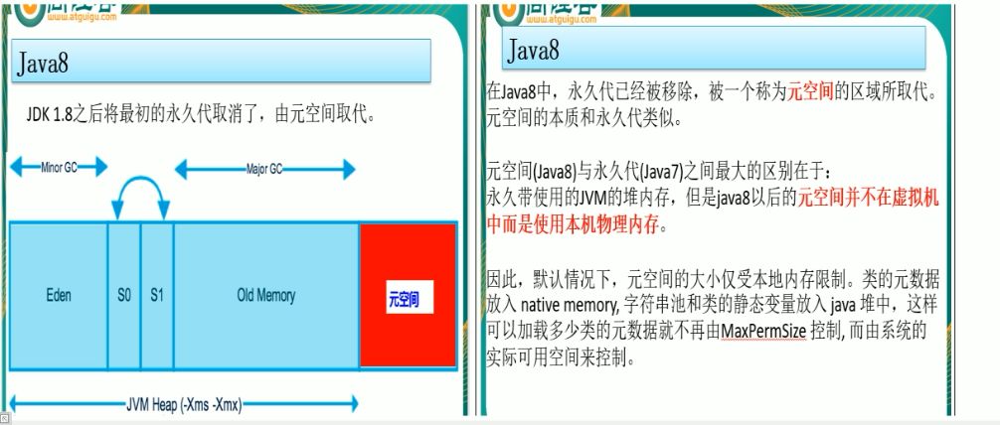

用代码获取jvm中的内存相关信息

```java
long totalMemory = Runtime.getRuntime().totalMemory();
long maxMemory = Runtime.getRuntime().maxMemory();
```

如果JVM在启动的时候没有指定**Xms**大小，则默认是系统总内存的**64分之一**  
如果JVM在启动的时候没有指定**Xmx**大小，则默认是系统总内存的**4分之一**   
#### -Xss 设置线程栈大小
当没有设置栈大小的时候，使用`jinfo -flag ThreadStackSize [pid] `会发现显示的是0值  
  
在这里，0就代表了使用默认值，在不同的平台，有可能有着不同的默认值  


java官方文档地址：https://docs.oracle.com/en/java/javase/11/tools/java.html  

#### -Xmn 设置年轻代大小


#### -XX:MetaspaceSize 设置元空间大小
元空间的本质和永久代相似，都是对JVM规范中的方法区的实现。不过元空间与永久代之间最大的区别在于：**元空间不在虚拟机中，而是使用本地内存**。  
因此，默认情况下，元空间大小仅仅受本地内存限制。  

#### -XX:PrintGCDetails 打印GC信息

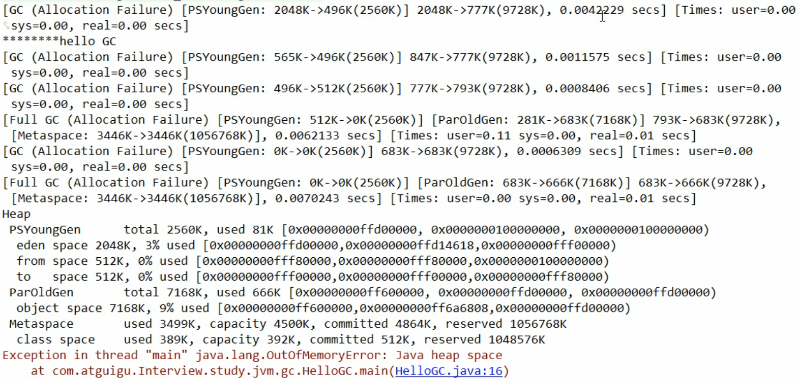

GC信息解读  


FGC信息解读  

  
  
#### -XX:SurvivorRatio 调整新生代(Eden)与幸存区(survivor)空间大小比例
默认值是8  

#### -XX:NewRatio 配置年轻代与老年代在堆结构中的占比
默认是2  
-XX:NewRatio=2 新生代占1，老年代占2，年轻代占整个堆的1/3  
-XX:NewRatio=4 新生代占1，老年代占4，年轻代占整个堆的1/5  
NewRatio值就是设置老年代的占比，剩下的1给新生代  

#### -XX:MaxTenuringThreshold 最大晋升年龄
-XX:MaxTenuringThreshold = 15表示，一个对象，从新生代到老年代，要经过15次垃圾回收，才能晋升到老年代  
如果设置为0的话，年轻代在第一次GC之后是不会经过Survivor区，直接进入老年代。对于老年代比较多的应用，可以提高效率。如果将此值设置为一个较大值，则年轻代对象会在survivor区进行多次复制，这样可以增加对象在年轻代的存活时间，增加在年轻代被回收的概率。  
### JVM的两种模式
当使用的是32位的Windows操作系统，不论硬件如何都默认使用Client的JVM模式  
32位其他操作系统，2G内存同时有2个cpu以上用Server模式，低于该配置还是Client模式  
64位，只有server模式

## 强软弱虚四种引用

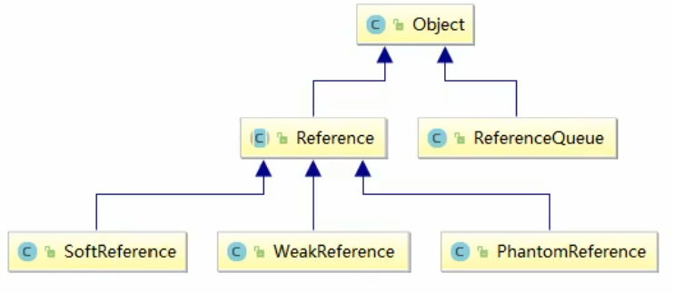  

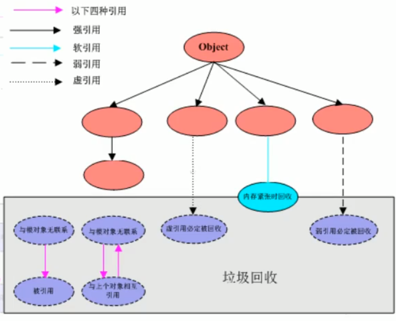

### Reference 强引用
`Book bk = new Book()`  
当内存不足时，JVM开始垃圾回收，对于强引用的对象，**就算是出现了OOM也不会对该对象进行回收，死都不收**  
强引用是我们最常见的引用，只要还有强引用指向一个对象，就能表明对象还“活着”，垃圾收集器不会碰这种对象。在Java中最常见的就是强引用，把一个对象赋给一个引用变量，这个引用变量就是一个强引用。当一个对象被强引用变量引用时，它处于可达状态，它是不可能被垃圾回收机制回收的，**即使该对象以后永远都不会被用到，JVM也不会回收**。因此强引用是造成Java内存泄漏的主要原因之一。  
对于一个普通对象，如果没有其他的引用关系，只要超过了引用的作用域或者显式地将相应(强)引用赋值为null，一般认为就是可以被垃圾收集的了(当然具体回收时机还是要看垃圾收集策略)
### SoftReference 软引用
软引用时一种相对强引用弱化了一些的引用，需要用java.lang.ref.SoftReference类来实现，可以让对象豁免一些垃圾回收。 
对于只有软引用的对象来说:  
当系统内存**充足**时它**不会**回收  
当系统内存**不足**时它**会**被回收  

> 软引用通常用在对内存敏感的程序中，比如高速缓存就有用到软引用，内存够用的时候就保留，不够用就回收！
>
> mybatis 缓存相关有用到

### WeakReference 弱引用
弱引用需要用java.lang.ref.WeakReference类来实现，它比软引用的生存期更短  
对于只有弱引用的对象来说，只要垃圾回收机制一运行，不管JVM的内存空间是否足够，都会回收该对象占用的内存  

**使用场景**：  
假如有一个应用需要读取大量的本地图片，可以用一个HashMap来保存图片的路径和相应图片对象关联的软引用之间的映射关系，在内存不足时，JVM会自动回收这些缓存图片对象所占用的空间，从而有效的避免OOM的问题  
设计缓存的时候，也可以按照这样来设置，当内存不足时，从缓存map中回收一些软引用的对象来保持内存不会撑爆  

> WeakHashMap： 当GC发生时，map中的key在外部没有强引用的时候，key会被回收

### PhantomReference 虚引用
虚引用不会决定对象的生命周期  
如果一个对象仅持有虚引用，那么它就和没有任何引用一样，在任何时候都可能被垃圾回收器回收，它不能单独使用也不能通过它访问对象，虚引用必须和引用队列(ReferenceQueue)联合使用。  

虚引用的主要作用是跟踪对象被垃圾回收的状态。仅仅是提供了一种确保对象被finalize以后，做某些事情的机制。  

PhantomReference的get方法总是返回null，因此无法访问对应的引用对象。其意义在于说明一个对象已经进入finalization阶段，可以被gc回收，用来实现比finalization机制更灵活的回收操作。  

设置虚引用关联的唯一目的，就是在这个对象被收集器回收的时候收到一个系统通知或者后续添加进一步的处理。Java技术允许使用finalize()方法在垃圾收集器将对象从内存清除出去之前做必要的清理工作。  
### ReferenceQueue 引用队列
ReferenceQueue 是用来配合引用工作的，没有ReferenceQueue一样可以运行  

创建引用的时候可以指定关联的队列，当GC释放对象内存的时候会将引用加入到引用队列，如果程序发现某个虚引用已经被加入到了引用队列，那么就可以在所引用的对象的内存被回收之前采取必要的行动，这相当于是一种通知机制  
当关联的引用队列中有数据的时候，意味着引用指向的堆内存中的对象被回收。通过这种方式，JVM允许我们在对象被销毁后，做一些自定义的事情  
`ReferenceQueue<Object> queue = new ReferenceQueue<>();`

# OutOfMemoryError

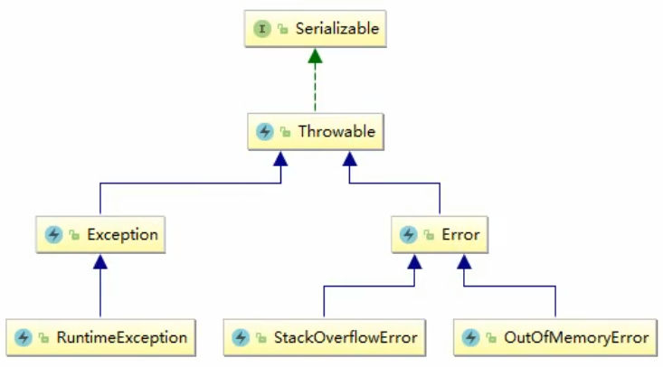  

在说这些问题的时候，要注意什么是异常，什么是错误，不能混淆和乱说。

## StackOverflowError

一般出现在递归调用的过程中把调用栈打爆了

## Java heap space

堆内存不足，很常见的异常

## GC overhead limit exceeded


GC任务繁重，gc使用的时间占比超过了限制阈值  

GC回收时间过长时会抛出OOM。过长的定义是，超过98%的时间用来做GC并且回收了不到2%的堆内存，连续多次GC都只回收了不到2%的极端情况下才会抛出。  
假如不抛出 GC overhead limit exceeded 错误会发生什么情况呢，那就是GC清理的这么点内存很快会再次填满，迫使GC再次执行，就形成了恶性循环，CPU占用率一直是100%，而GC却没有任何成果

## Direct buffer memory
写NIO程序经常使用ByteBuffer来读取或者写入数据，这是一种基于通道(channel)与缓冲区(buffer)的I/O方式。它可以使用native函数库直接分配堆外内存，然后通过一个存储在Java堆里面的DirectByteBuffer对象作为这块内存的引用进行操作。这样能在一些场景中显著提高性能，因为避免了在Java堆和Native堆中来回复制数据。  
`ByteBuffer.allocate(capability)` 第一种方式是分配JVM堆内存，属于GC管辖范围，由于需要拷贝，所以速度相对较慢  
`ByteBuffer.allocateDirect(capability)` 第二种方式是分配OS本地内存，不属于GC管辖范围，由于不需要内存拷贝，所以速度相对较快。  
但如果不断分配本地内存，堆内存很少使用，那么JVM就不需要执行GC，DirectByteBuffer对象们就不会被回收，这时候堆内存充足，但本地内存可能已经使用光了，再次尝试分配本地内存就会出现OutOfMemoryError

> 一般默认JVM可以使用的本地内存为最大物理内存的1/4

## Unable to create new native thread 

首先考虑是不是内存不足，可能由于堆设置过大，导致线程可使用的内存过少，因为线程创建是要为其分配PC计数器，虚拟机栈，本地方法栈的，在不增大内存的情况下，可以减小堆大小和栈大小来创建更多的线程。但是通过现场的jmap -heap [pid] 查看内存占用其实并不多，用jstack统计线程数，有近500，大部分是来自tomcat线程池与hbase线程。所以考虑是不是hbase抖动。
    
由于hbase端出现抖动，导致线程池线程数量拉高，这个现象也会在hbase线程池体现，因为一个请求会由一个tomcat线程来处理，同时也对应着一个hbase线程池的线程，当线程池的达到了最大核心线程的数量，同时阻塞队列满的时候，就会继续开启新的线程来进行处理，直到达到了线程池最大线程数的限制，spring-boot自带的tomcat默认线程池最大线程数是200，所以最坏情况下会同时处理200个请求，其他的进入等待队列，200个请求也会同样对应hbase连接池的200个处理线程，这里保守就有400个线程。又由于当时服务器设置的max user processes只有1024，同时，服务器上还部署着一些其他java服务，所以高峰时刻，冲过了1024，达到了max user processes的限制。系统拒绝了线程的创建，导致了这个问题出现。由于不能随意重启线上服务，所以我通过修改/proc/{pid}/limits中的Max processes 对应的soft limits，使得服务能继续创建线程，暂时维持了服务稳定，，同时其他服务也一并修改，但是后续评估发现，max user processes也的确设置的过小了，就将这个值修改为了10240，并择机将机器上服务全部滚动重启，使参数生效。

对于这个问题，可以通过改大max user processes参数，也可以降低tomcat 线程池大小，或者控制hbase线程池大小来缓解这个问题

`ps -mp [PID] -o THREAD, tid, time  其中-m 表示显示所有线程，-p pid进程使用的CPU时间 -o 该参数后是用户自定义格式`  

`转16进制 printf "%x\n" [线程ID]`

## Metaspace
Java8及以后的版本使用Metaspace来替代永久代。  
Metaspace是方法区在HotSpot中的实现，它与永久代最大的区别在于: Metaspace并不在虚拟机内存中而是使用的本地内存，也就是说在Java8 类的元数据信息被存储在叫做Metaspace的native memory当中  
永久代(Java8后被元空间取代了) 存放了以下信息：
1.已被虚拟机加载的类信息
2.运行时常量池
3.字符串常量池(JDK7从永久代移出)
4.静态变量(JDK7 从永久代移出)
5.即时编译后的代码  
> The Java Virtual Machine has a method area that is shared among all Java Virtual Machine threads. The method area is analogous to the storage area for compiled code of a conventional language or analogous to the "text" segment in an operating system process. It stores per-class structures such as the **run-time constant pool**, **field** and **method data**, and **the code for methods** and **constructors**, including the special methods (§2.9) used in class and instance initialization and interface initialization
>
> 引用自：《Java虚拟机规范》https://docs.oracle.com/javase/specs/jvms/se8/html/jvms-2.html#jvms-2.5.4


所以，模拟Metaspace溢出。只要不断生成新的类往Metaspace中写即可。  动态生成类可以使用CGLIB 的字节码技术

# GC相关

GC算法(复制算法/标记清除/标记整理/分代算法)是内存回收的方法论，垃圾收集器就是算法的落地实现  

> 天上飞的理念，需要有落地的实现 ^_^

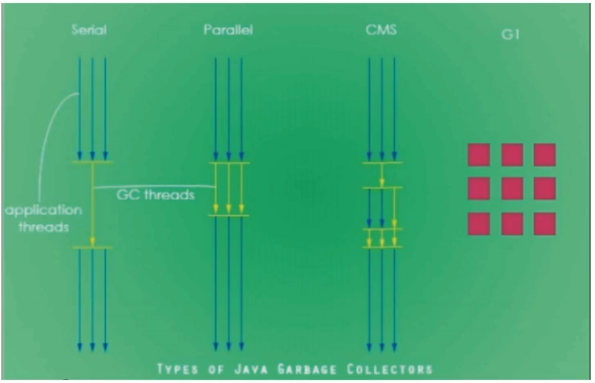

串行(serial)，并行(parallel)，并发(concurrent)，G1  

串行：垃圾回收前，先停止用户线程(STW:stop the world)，然后只有一个垃圾收集线程工作，由于垃圾收集的时候会**暂停**用户**所有**线程，不适合服务器环境  
并行：垃圾回收前，先停止用户线程，然后有多个垃圾收集线程工作，适用于科学计算/大数据处理等弱交互场景  
并发：垃圾回收时，用户线程和垃圾收集线程同时执行(不一定是并行，可能是交替执行)，不需要停顿用户线程，适用于对响应时间有要求的场景  
G1: G1垃圾回收器将堆内存分隔成不同的区域然后并发的对其进行垃圾回收

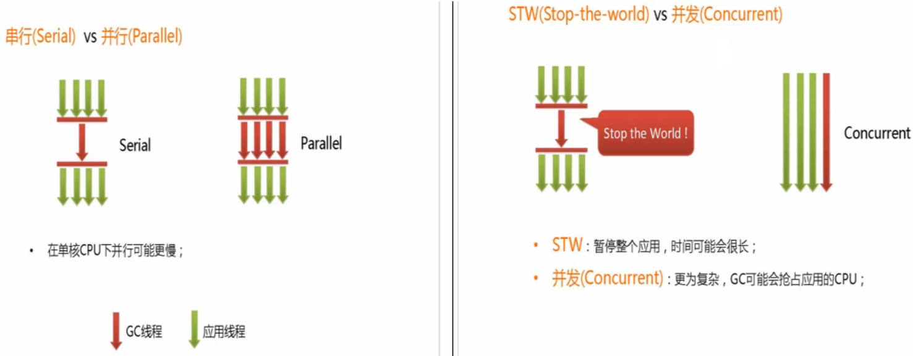

查看默认的垃圾回收器，使用-XX:+PrintCommandLineFlags 可以打印出正在使用的参数项
```shell
F:\IdeaProject\RookieRoad>java -XX:+PrintCommandLineFlags -version
-XX:InitialHeapSize=132499904 -XX:MaxHeapSize=2119998464 -XX:+PrintCommandLineFlags -XX:+UseCompressedClassPointe
rs -XX:+UseCompressedOops -XX:-UseLargePagesIndividualAllocation -XX:+UseParallelGC
java version "1.8.0_71"
Java(TM) SE Runtime Environment (build 1.8.0_71-b15)
Java HotSpot(TM) 64-Bit Server VM (build 25.71-b15, mixed mode)
```
可以看到，jdk8默认使用的是`ParallelGC`  
对于运行中的服务，可以使用jinfo进行查看`jinfo -flag UseParallelGC [pid]`
## GC算法


## 垃圾回收器
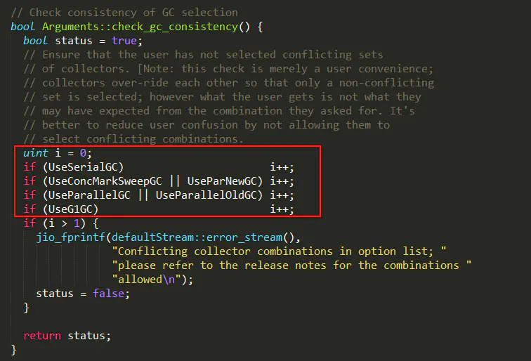

上面函数式JVM验证GC配置的合理性。同时也可以看出，有如代码所示的几种垃圾回收器  
UseSerialGC  
UserParallelGC (parallel scavenge)  
UseParallelOldGC  
UseConcMarkSweepGC  
UseParNewGC  
UseG1GC

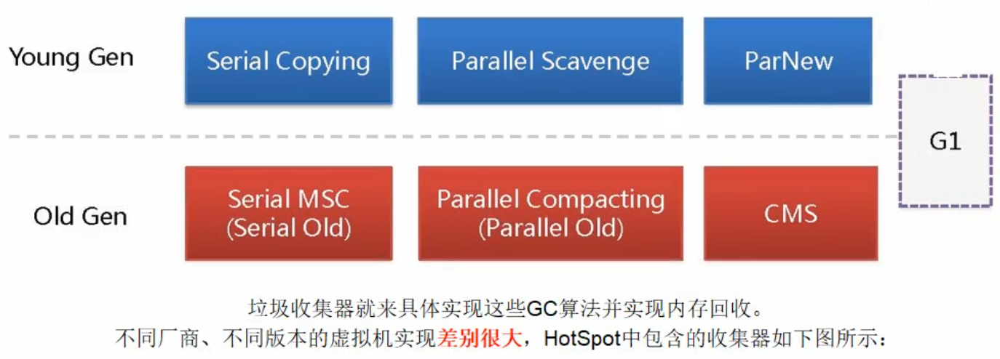  

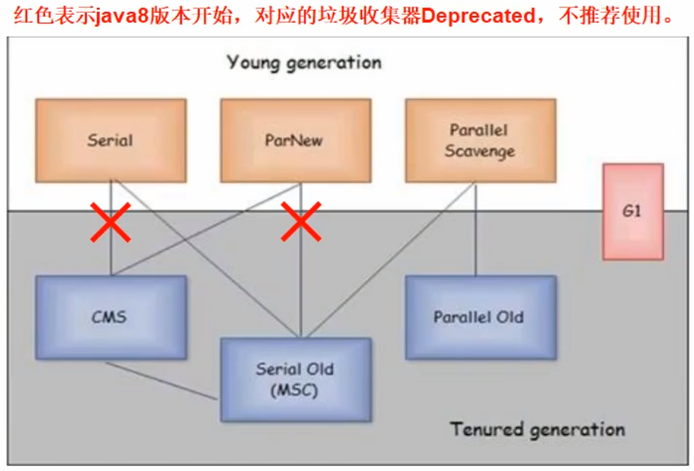

打了叉的表示连线的两个是**不能**组合使用的  
### 新生代收集
#### 串行收集器 SerialGC
一个单线程的收集器，在进行垃圾收集的售后必须暂停其他所有工作线程直到它收集结束。  

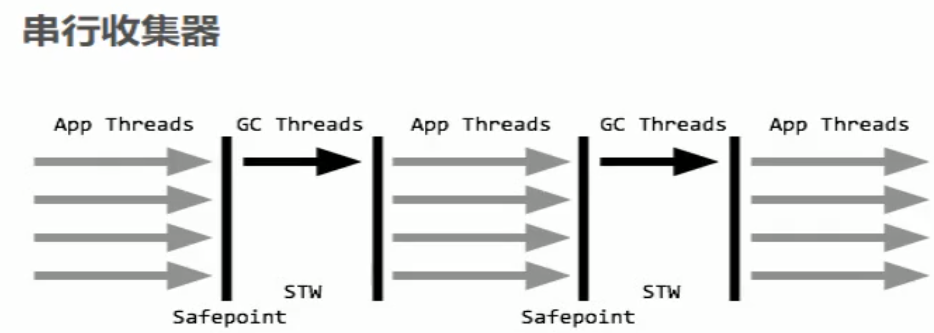

串行收集器是最古老，最稳定以及效率高的收集器，只使用一个线程去回收，但其在进行垃圾收集的过程中可能会产生较长的停顿(STW).虽然在收集垃圾过程中需要暂停所有其他的工作线程，但是它简单高效，对于限定单个CPU环境来说，没有线程交互的开销可以获得最高的单线程垃圾收集效率，因此Serial垃圾收集器依然是Java虚拟机运行在Client模式下默认的新生代垃圾收集器。  

在开启后，会使用SerialGC(Young区使用) + Serial Old(Old区用)的收集器组合  
在新生代与老年代都会使用串行垃圾回收器，新生代使用复制算法，老年代使用标记-整理算法  

> 在GC日志中，新生代会使用DefNew表现；老年代使用Tenured

#### 并行收集器 ParNew
**使用复制算法**  
ParNew收集器其实就是Serial收集器新生代的并行多线程版本，最常见的应用场景是配合老年代的CMS GC工作，其余的行为和Serial收集器完全一样，ParNew垃圾收集器在垃圾收集过程中同样也要暂停所有其他的工作线程。他是很多Java虚拟机运行在Server模式下新生代的默认垃圾收集器。  
常用对应的JVM参数: -XX:+UserParNewGC，启用ParNew收集器，只影响新生代的手机，不影响老年代。开启上述参数后，会使用ParNew(Young区用) + Serial Old的收集器组合，新生代使用复制算法，老年代采用标记-整理算法
> 在GC日志中，新生代会使用ParNew表示

#### 并行收集器 Parallel Scavenge
Parallel Scavenge和ParNew同为使用**复制算法**，也都是并行的多线程收集器。  
不同点在于Parallel Scavenge它的关注点与其他收集器不同，CMS等收集器的关注点是尽可能地缩短垃圾收集时用户线程的停顿时间，而PS收集器的目标则是达到一个可控制的吞吐量。所谓吞吐量就是CPU用于运行代码的时间与CPU总消耗时间的比值，即：吞吐量 = 运行用户代码时间 / (运行用户代码时间 + 垃圾收集时间)  
停顿时间越短就越适合需要与用户交互的程序，良好的响应速度能提升用户体验，而高吞吐量则可以高效率地利用CPU时间，尽快完成程序的运算任务，主要适合在后台运算而不需要太多交互的任务。  

Parallel Scavenge收集器提供了两个参数用于精确控制吞吐量，分别是控制最大垃圾收集停顿时间的-XX:MaxGCPauseMillis参数以及直接设置吞吐量大小的-XX:GCTimeRatio参数。  

MaxGCPauseMillis参数允许的值是一个大于0的毫秒数，收集器将尽可能地保证内存回收花费的时间不超过设定值。不过大家不要认为如果把这个参数的值设置得稍小一点就能使得系统的垃圾收集速度变得更快，GC停顿时间缩短是以牺牲吞吐量和新生代空间来换取的：系统把新生代调小一些，收集300MB新生代肯定比收集500MB快吧，这也直接导致垃圾收集发生得更频繁一些，原来10秒收集一次、每次停顿100毫秒，现在变成5秒收集一次、每次停顿70毫秒。停顿时间的确在下降，但吞吐量也降下来了。  

GCTimeRatio参数的值应当是一个大于0且小于100的整数，也就是垃圾收集时间占总时间的比率，相当于是吞吐量的倒数。如果把此参数设置为19，那允许的最大GC时间就占总时间的5%（即1 /（1+19）），默认值为99，就是允许最大1%（即1 /（1+99））的垃圾收集时间。  

由于与吞吐量关系密切，Parallel Scavenge收集器也经常称为“吞吐量优先”收集器。除上述两个参数之外，Parallel Scavenge收集器还有一个参数-XX:+UseAdaptiveSizePolicy值得关注。这是一个开关参数，当这个参数打开之后，就不需要手工指定新生代的大小（-Xmn）、Eden与Survivor区的比例（-XX:SurvivorRatio）、晋升老年代对象年龄（-XX:PretenureSizeThreshold）等细节参数了，虚拟机会根据当前系统的运行情况收集性能监控信息，动态调整这些参数以提供最合适的停顿时间或者最大的吞吐量，这种调节方式称为GC自适应的调节策略（GC Ergonomics）。  

> 当配置了-XX:+UserParallelGC或-XX:+UseParallelOldGC时，他们会互相激活，即配置了一个自动使用另外一个 
>
> -XX:ParallelGCThreads=N 表示启动多少个GC线程 
>
> CPU>8 N = 5/8
>
> CPU <8 N = 实际个数

> 在GC日志中，新生代会使用PSYoungGen表示，老年代会使用ParOldGen

### 老年代收集

#### 串行收集器 Serial Old
Serial Old 是Serial垃圾收集器的老年代版本，它同样是个单线程的收集器，使用标记-整理算法，这个收集器也主要是运行在Client端Java虚拟机默认的年老代垃圾收集器  
在Server模式下，主要有两个用途：  
1、在JDK1.5之前版本中与新生代的Parallel Scavenge收集器搭配使用。  
2、作为老年代中使用CMS收集器的后备垃圾收集方案

#### 并行收集器 Parallel Old

Parallel Old收集器是Parallel Scavenge的老年代版本，使用多线程的标记-整理算法，Parallel Old收集器在JDK1.6才开始提供。  

在JDK1.6之前，新生代使用Parallel Scavenge收集器只能搭配Serial Old 收集器，只能保证新生代的吞吐量优先，无法保证整体的吞吐量。  

Parallel Old 正是为了在年老代同样提供吞吐量优先的垃圾收集器，如果系统对吞吐量要求比较高，JDK1.8后可以优先考虑新生代Parallel Scavenge和年老代Parallel Old的搭配策略  

> 在GC日志中，新生代会使用PSYoungGen表示，老年代会使用ParOldGenv  

#### 并发标记清除 CMS(Concurrent Mark Sweep)


它是一种以获取最短回收停顿时间为目标的收集器。  

适合应用在互联网网站或者B/S系统的服务器上，这类应用尤其重视服务器的响应速度，希望系统停顿时间最短。  

CMS非常适合堆内存大、CPU核数多的服务器端应用，也是G1出现之前大型应用的首选收集器。   

> 开启-XX:+UseConcMarkSweepGC后，会自动打开-XX:+UseParNewGC
>
> 最终会使用ParNew(Young区用) + CMS(Old区用) + Serial Old的收集器组合，**Serial Old 将作为CMS出错后的后备收集器**

**并发标记清除的四个步骤： **  
1. 初始标记(initial mark): 只是标记一下GC Roots 能直接关联的对象，速度很快，仍然需要暂停所有的工作线程  
2. 并发标记(concurrent mark): 进行GC Roots跟踪的过程，和用户线程一起工作，不需要暂停工作线程。主要标记过程，标记全部对象  
3. 重新标记(remark): 为了修正在并发标记期间，因用户程序继续运行而导致标记产生变动的那一部分对象的标记记录，仍然需要暂停所有的工作线程。  
4. 并发清除(concurrent sweep): 清除GC Roots不可达对象，和用户线程一起工作，不需要暂停工作线程。基于标记结果，直接清理对象。 由于耗时最长的并发标记和并发清除过程中，垃圾收集线程可以和用户线程一起并发工作，所以总体上来看CMS收集器的内存回收和用户线程是一起并发执行的。  
优点：并发收集停顿低  
缺点：采用并发执行，对CPU资源压力大；采用的标记清除算法会导致大量碎片  
由于标记清除算法无法整理空间碎片，老年代空间会随着应用时长被逐步耗尽，最后将不得不通过担保机制对堆内存进行压缩。CMS也提供了参数-XX:CMSFullGCsBeforeCompaction(默认是0，即每次都进行内存整理)来指定多少次CMS收集之后，进行一次压缩的Full GC  
> 由于并发进行，CMS的收集线程与应用线程会同时增加对堆内存的占用，也就是说，CMS必须要在老年代内存用尽之前完成垃圾回收，否则CMS回收失败时，将触发担保机制，串行老年代收集器将会以STW的方式进行一次GC，从而造成较大的停顿时间

> 内存分配是在JVM在内存分配的时候，新生代内存不足时，把新生代的存活的对象搬到老生代，然后新生代腾出来的空间用于为分配给最新的对象。这里老生代是担保人。在不同的GC机制下，也就是不同垃圾回收器组合下，担保机制也略有不同。在Serial+Serial Old的情况下，发现放不下就直接启动担保机制；在Parallel Scavenge+Serial Old的情况下，却是先要去判断一下要分配的内存是不是**>=Eden区大小的一半**，如果是那么直接把该对象放入老生代，否则才会启动担保机制。

### G1垃圾回收器
> 在GC日志中体现为 garbage-first heap 

 
> The Garbage-First (G1) collector is a server-style garbage collector, targeted for multi-processor machines with large memories. It meets garbage collection (GC) pause time goals with a high probability, while achieving high throughput. The G1 garbage collector is fully supported in Oracle JDK 7 update 4 and later releases. The G1 collector is designed for applications that: 
Can operate concurrently with applications threads like the CMS collector. 
Compact free space without lengthy GC induced pause times. 
Need more predictable GC pause durations. 
Do not want to sacrifice a lot of throughput performance. 
Do not require a much larger Java heap.

特性：  
像CMS收集器一样，能与应用程序线程并发执行。  
整理空闲空间更快  
需要更多的时间来预测GC停顿时间  
不希望牺牲大量的吞吐性能，不需要更大的Java Heap  
**G1收集器的设计目标是取代CMS收集器**，它同CMS相比，在以下方面表现的更出色：  
G1是一个有整理内存过程的垃圾收集器，不会产生很多内存碎片。  
G1的STW更可控，G1在停顿时间上添加了预测机制，用户可以指定期望的停顿时间   

在内存功能划分上，主要改变是Eden，Survivor和Tenured等内存区域不再是连续的了，而是变成了一个个大小一样的region，每个region从1M到32M不等。一个region有可能属于Eden，Survivor或者Tenured内存区域。  
#### 原理
区域化内存划分，称为region，是一些不连续的内存区域，避免了全内存区域的GC操作。  

核心思想是将整个堆内存区域分成大小相同的子区域(Region),在JVM启动时会自动设置这些子区域的大小，在堆的使用上，**G1并不要求对象的储存一定是物理上连续的，只要逻辑上连续即可**，每个分区也不会固定地为某个代服务，可以按需的在年轻代与老年代之间切换。启动时可以通过参数-XX:G1HeapRegionSize=n可指定分区大小(1MB~32MB,**且必须是2的幂**)，默认将整堆划分为2048个分区，最多也只能设置2048个区域，也即能够支持的最大内存为：32MB * 2046 = 65535MB = 64G内存  

  
G1收集器将堆划分为若干个区域，它仍属于分代收集器  
这些Region的一部分包含新生代，新生代的垃圾收集依然采用**暂停所有应用线程**的方式，将存货对象拷贝到老年代或者Survivor空间。  
这些Region的一部分包含老年代，G1收集器通过将对象从一个区域复制到另外一个区域，完成了清理工作。这就意味着，在正常的处理过程中，G1完成了堆(部分)的压缩，这样也就不会有CMS内存碎片的问题存在了  
在G1中还有一种特殊的区域，叫Humongous（巨大的）区域，如果一个对象占用的空间超过了分区容量的50%以上，G1收集器就认为这是一个巨型对象。这些巨型对象默认直接会被分配在年老代，但是如果它是一个短期存在的 巨型对象，就会对垃圾收集器造成负面影响。为了解决这个问题，G1划分了一个Humengours区，它专门用来存放巨型对象。如果一个H区装不下一个巨型对象，那么G1会寻找连续的H区来储存。为了能寻找到连续的H区，有时候不得不启动Full GC
#### 动作
针对Eden区进行收集，Eden区耗尽后会被触发，主要是小区域收集 + 形成连续的内存块，避免内存碎片。  
Eden区的数据移动到Survivor区，假如出现Survivor区空间不够，Eden区数据会部分晋升到Old区  
Survivor区的数据移动到新的Survivor区，部分数据会晋升到Old区  
最后Eden区收拾干净，GC结束，用户的应用程序继续执行  

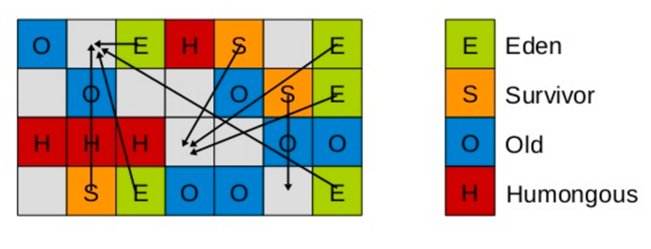  
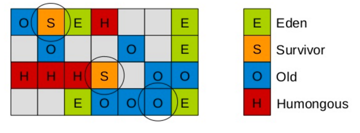

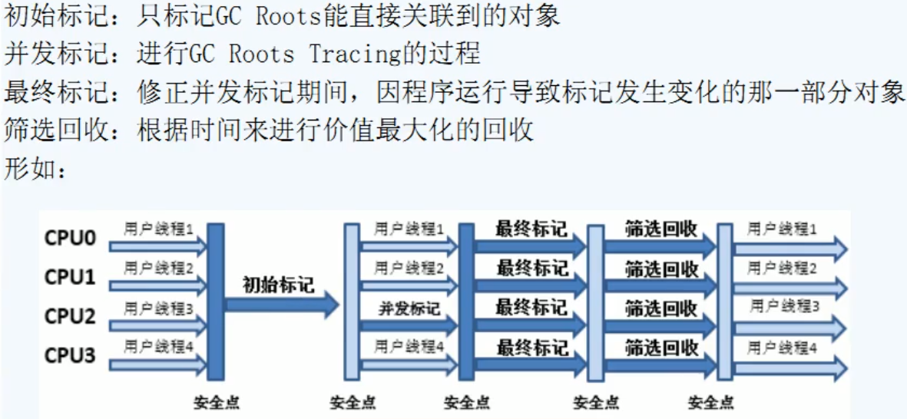

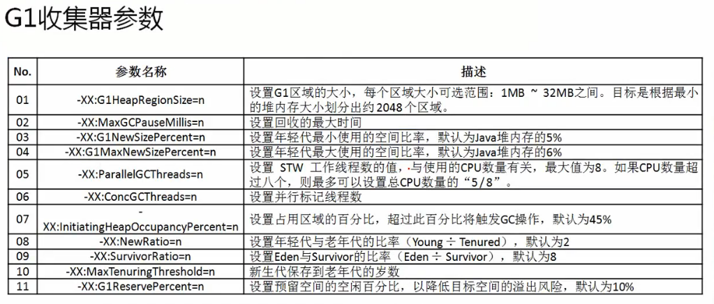

详细请参看 ： https://blog.csdn.net/u013380694/article/details/83341913
### 垃圾收集器的选择


单CPU或小内存，单机程序：SerialGC  
多CPU，需要最大吞吐量，如后台计算型应用：ParallelGC  
多CPU，追求低停顿时间，需快速响应如互联网应用: CMS + ParNew 


# JVM结构

  

沙箱安全机制：https://blog.csdn.net/qq_30336433/article/details/83268945

## 类加载器(ClassLoader)

负责加载class文件，class文件在**文件开头有特定的文件表示**，将class文件字节码内容加载到内存中，并将这些内容转换成方法区中的运行时数据结构并且ClassLoader只负责class文件的加载，至于它是否可以运行，则由Execution engine决定。
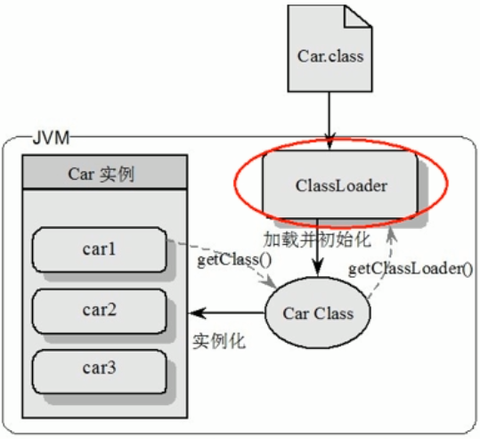  

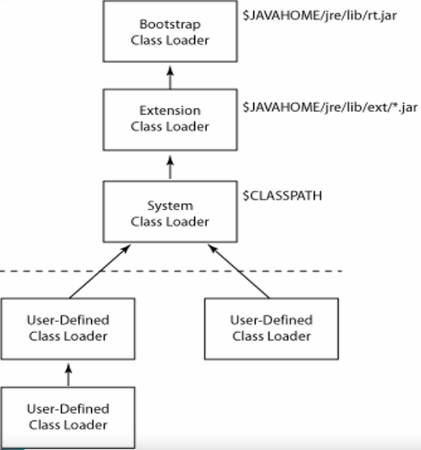  

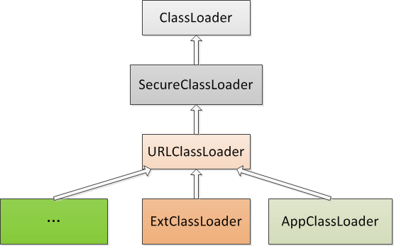

启动类加载器(Bootstrap Class Loader)(C++)  
扩展类加载器(Extension Class Loader)(Java)  
应用程序类加载器(AppClassLoader) 也叫系统类加载器，加载当前应用的classpath的所有类  

通过getClassLoader方法，可以获取到一个类的类加载器  
```java
Object o = new Object();
ClassLoaderDemo d = new ClassLoaderDemo();
System.out.println(o.getClass().getClassLoader());
System.out.println(d.getClass().getClassLoader());
System.out.println(d.getClass().getClassLoader().getParent());
//getParent方法可以获得该类加载器的父加载器
System.out.println(d.getClass().getClassLoader().getParent().getParent());

输出：
null
sun.misc.Launcher$AppClassLoader@18b4aac2
sun.misc.Launcher$ExtClassLoader@45ee12a7
null
```

BootstrapClassLoader是获取不到它的引用的，也意味着所有通过BootstrapClassLoader加载的类，通过调用getClassLoader()返回的都是null。因为BootstrapClassLoader是C/C++编写的，它本身是虚拟机的一部分，所以它并不是一个JAVA类，也就是无法在Java代码中获取它的引用。

### 双亲委派机制
当类加载器需要加载一个类的时候，它会先委派它的父加载器来进行加载，当父加载器无法加载的时候(在它的加载路径下没有找到所需加载的Class)，再亲自来加载，如果亲自加载也无法加载，则报ClassNotFoundException.
比如，加载位于rt.jar包中的类java.lang.Object，不管是哪个加载器加载了这个类，最终都是委托给顶层的启动类加载器进行加载，这样就保证了使用不同的类加载器最终得到的都是同样一个Object对象  
使用的好处：  
  可以保证Java原生的类的安全，避免被篡改。  
## Execution Engine 
负责解释命令，提交给操作系统执行  
## Native Interface 本地结构

本地接口的作用是融合不同的编程语言为Java所用，它的初衷是融合C/C++程序，Java诞生的时候是C/C++横行的时候，要想立足，必须有调用C/C++程序，于是就在内存中专门开辟了一块区域处理标记为native的代码，它的具体做法是Native Method Stack中登记native方法，在Execution Engine 执行时加载native libraries。  

目前该方法使用的越来越少，除非是与硬件有关的应用，比如通过Java程序驱动打印机或者Java系统管理生产设备，在企业级应用中已经比较少见。因为现在的异构领域间的通信很发达，比如可以使用socket通信，也可以使用Web Service等等。

## RunTime Data Area

### Native Method Stack 本地方法栈(线程私有)

它的具体做法是NativeMethod Stack中登记native方法，在Execution Engine执行时加载本地方法库。  

### Program Counter Register 程序计数器(线程私有)

每个线程都有一个程序计数器，是线程私有的，就是一个指针，指向方法区中的方法字节码(**用来储存指向下一条指令的地址，也即将要执行的指令代码**)，由执行引擎读取下一条指令，是一个非常小的内存空间(**也是JVM中唯一一个没有定义OOM的内存区域**)  

这块内存区域很小，它是当前线程所执行的字节码的行号指示器，字节码解释器通过改变这个计数器的值来选取下一条需要执行的字节码指令。  

注意：如果执行的是一个Native方法，那这个计数器是空的。  

程序计数器用于完成分支、循环、跳转、异常处理，线程恢复等基础功能。  

### Method Area 方法区(线程共享)

供各个线程的运行时内存区域。**它储存了每一个类的结构信息**，例如运行时常量池(Runtime Constant Pool)、字段和方法数据、构造函数和普通方法的字节码内容。上面讲的是规范，在不同虚拟机里面实现是不一样的，最典型的就是永久代(PermGen space)和元空间(Metaspace)

> 实例储存在堆中，和方法区无关

> 在jdk1.7的时候，符号引用(Symbols)转移到了native heap；String常量池(interned strings)转移到了 java heap; 类的静态变量(class statics)转移到了java heap.
>
> 在1.8的时候，彻底用元空间替代了永久代

### VM Stack 虚拟机栈(线程私有)

栈也叫栈内存，主管Java程序的运行，是在**线程创建时创建**(所以是线程私有)，它的生命周期是跟随线程的生命期，线程结束栈内存也就释放，所以对于栈来说不存在垃圾回收问题。生命周期和线程一直，是线程私有的。8种基本类型(byte, char, boolean, short, int, long, float, double) + 对象的引用变量 + 实例方法都是在函数的栈内存中分配。  

栈帧中主要保存3类数据：  

本地变量(Local Variables) : 输入参数和输出参数以及方法内的变量；  

栈操作(Operand Stack) : 记录出栈、入栈的操作；  

栈帧数据(Frame Data) : 包括类文件、方法等。  

每一个方法执行的同时都会创建一个栈帧，用于存储局部变量表、操作数栈、指向运行时常量池的引用，动态链接、方法返回地址信息，每一个方法从调用直至执行完毕的过程，就对应着一个栈帧在虚拟机中入栈到出栈的过程。栈的大小和具体JVM的实现有关，通常在256K~1MB之间

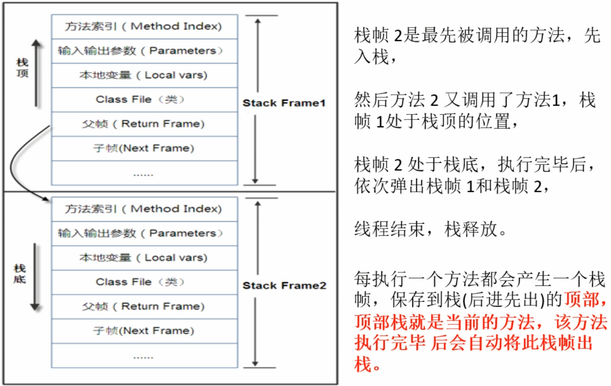  

#### 栈，堆，方法区的交互关系

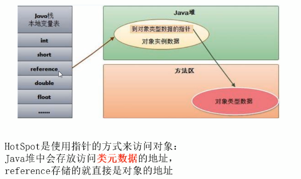

### Heap 堆

从**内存回收**的角度来看，由于现在收集器基本都采用**分代收集算法**，所以Java堆中还可以细分为：新生代，老年代：再细致一点的有Eden空间、From Survivor、To Survivor。  

从**内存分配**的角度来看，线程共享的Java堆中可能划分出多个线程私有的分配缓冲区(Thread Local Allocation Buffer, TLAB)。  

但是无论怎么划分，都与存放内容无关，无论哪个区域，存储的都仍然是对象实例。